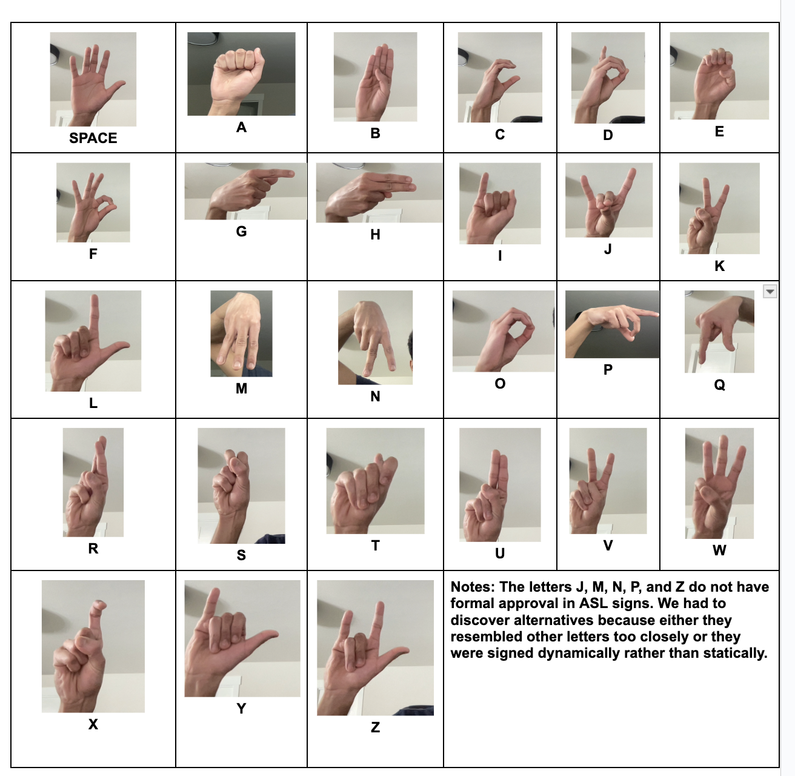

# ASL-Emotion Analyzer

Welcome to our ASL to Text with Emotional Analysis project! This project aims to bridge the communication gap between individuals using American Sign Language (ASL) and those who communicate through spoken or written language. By leveraging machine learning and natural language processing, we provide a platform for interpreting ASL alphabet gestures into text, coupled with emotional analysis to convey the sentiment behind the signs. Our goal is to foster a more inclusive society by making ASL more accessible and comprehensible to everyone, particularly benefiting individuals with Autism Spectrum Disorder (ASD) who may find it challenging to interpret emotional cues in sign language. This project was created by students at the University Of Washington Seattle: [Hrudhai Umas](https://www.linkedin.com/in/hrudhai-umas/), [Rohan Sabhaya](https://www.linkedin.com/in/rohansabhaya/) and [Kaden Kapadia](https://www.linkedin.com/in/kadenkapadia/).

## Motivation
Communication disparities, particularly in sign language, can lead to nuanced differences in interpretation. Our project seeks to address these disparities by developing a model adept at discerning emotional cues embedded within ASL and articulating them in natural language. This initiative aims to empower those learning or mastering ASL, thereby promoting universal communication parity and nurturing a more synergistic and inclusive environment.

## Demo Video
To see our project in action, check out this demo video showcasing how the system works, including real-time ASL sign recognition and sentiment analysis. 
[Click Here For A Demo Video Of How It Works](https://drive.google.com/file/d/1RiwllgoBs61RuCR96shx9Km0sbDQLUYR/view?usp=sharing)

## Our ASL Alphabet Chart:

1. Please note that our project only contains space through the letter S for compute reasons. Our next steps will be to include S to Z and incorporate dynamic words so users do not have to spell out every word.

## Check Out Our Report!
[Click Here For Our Report](https://docs.google.com/document/d/1BgsVERG-x7K5VbO3B08yguP0WZT0Ub4T4a3sbxkKbFY/edit?usp=sharing)

## System Requirements
* Python Version: 3.8 - 3.11 (Tested on Python 3.9.6) (IDE: PyCharm)
* Libraries: OS, OpenCV, Pickle, MediaPipe, Numpy, PyTorch, scikit-learn, transformers
* Hardware: A webcam for capturing sign language gestures

## Installation
`pip install opencv-python mediapipe numpy torch scikit-learn transformers`

## Project Structure
The project is structured into four main steps, each encapsulated in its own Python script:

1. collect_imgs.py: Captures ASL signs using a webcam and stores the images in a data folder. Each letter of the alphabet, including a sign for space, is represented by 300 images.
2. create_dataset.py: Processes the captured images to extract hand landmarks using MediaPipe, storing the data in a serialized format for training.
3. NeuralNetworkML.py: Trains a neural network model on the processed dataset to recognize ASL signs.
4. RealTimePredictionAndNLP.py: Utilizes the trained model for real-time ASL sign recognition and performs sentiment analysis on the interpreted signs.

## Data Folder
The data folder contains images of the ASL signs for each letter of the alphabet and a sign for space, with 300 images per sign. It's automatically generated and populated by running collect_imgs.py.

## Running the Project
To use the system, follow these steps in order. Note that we made it so you only have to run RealTimePredictionAndNLP.py for the program to work. Steps 1-3 are only required if you want to capture your images, create your dataset, and run the ML model on that dataset.

1. (OPTIONAL HAS ALREADY BEEN DONE) Run collect_imgs.py to collect images for each ASL sign (Only if you would like to train your own ASL Model)
2. (OPTIONAL HAS ALREADY BEEN DONE) Execute create_dataset.py to process the images and create a dataset. (Need to do if you ran collect_imgs.py)
3. (OPTIONAL HAS ALREADY BEEN DONE) Run NeuralNetworkML.py to train the machine learning model.
4. Finally, execute RealTimePredictionAndNLP.py for real-time sign recognition and sentiment analysis.

## Dependencies
This project relies on several libraries for image processing, machine learning, and natural language processing. Make sure you have the following dependencies installed:

1. os: Standard library in Python, no need for separate installation.
2. cv2 (OpenCV): For image processing and capturing webcam footage.
3. pickle: Standard library in Python for serializing and deserializing Python object structures.
4. mediapipe: For hand landmark detection.
5. numpy: For numerical computations and handling arrays.
6. torch (PyTorch): For implementing and training neural network models.
7. sklearn (scikit-learn): For data preprocessing and splitting the dataset.
8. transformers: For natural language processing, specifically for sentiment analysis.

## Acknowledgements
Our project stands on the shoulders of giants, leveraging open-source libraries such as OpenCV, MediaPipe, PyTorch, scikit-learn, and transformers. We extend our gratitude to all the contributors of these projects. Please also let us know if there is anything we can improve on!

## Final Words
By embracing the motto "The World is One Family," we are committed to removing communication barriers and fostering inclusivity across all boundaries. Join us in our journey towards creating a more accessible and understanding world.
